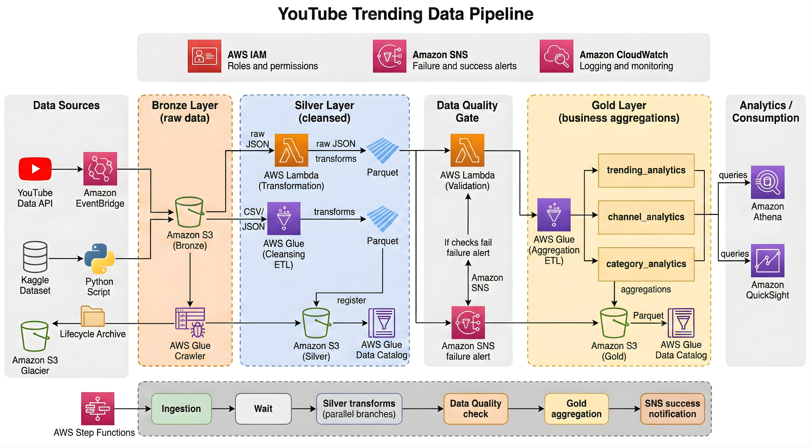

# aws_de_project

In this project we are going to execute an end to end aws focused data engineering project where in we build an end to end flow using kaggle static data and some youtube ata 

This can help say a sample customer who wants advertise based on seeing the importance of the data

here is the architecture designed:

kaggle dataset link: https://www.kaggle.com/datasets/datasnaek/youtube-new?resource=download

we will use aws lambda to convert json to parquet
and we will use glue to convert csv to parquet

also note the lamdafunction python files should be named as lamda_function
